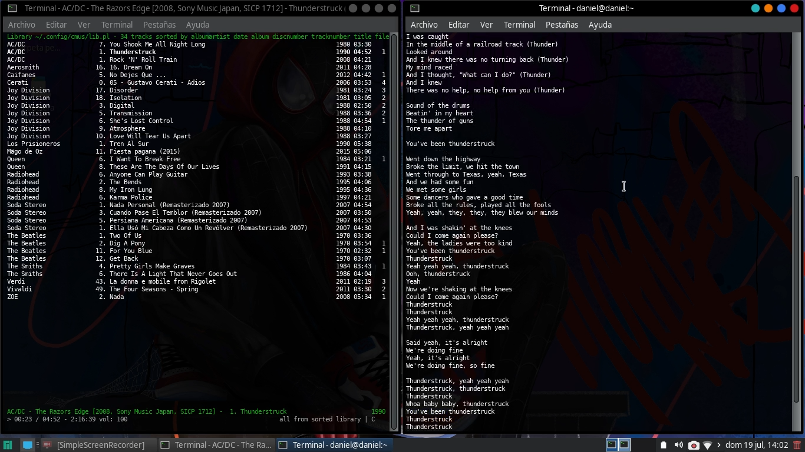

# Cmus + lyrics
Descargar letras de tus canciones reproducidas en cmus desde la terminal. (Funciona en Manjaro Linux)

**Instalar Cmus**

> sudo pacman -S cmus

**lyrics**

Instalar la libreria glyr desde Añadir/Quitar software y 
descargar el archivo el **cmus-lyrics.py** 

## Uso

Mientras reproduces tu música en cmus, ejecutas el archivo cmu-lyrics, en mi caso lo guarde el la carpeta Música/

> python  Música/cmus-lyrics.py

## Referencias

[https://cmus.github.io/]

[https://www.taringa.net/+linux/cmus-reproductor-de-musica-cmus-lyrics-py-por-mi_h71ch]
